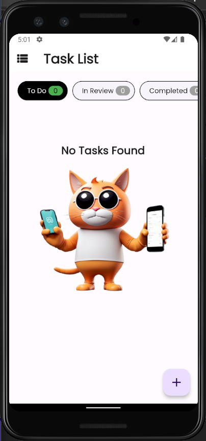
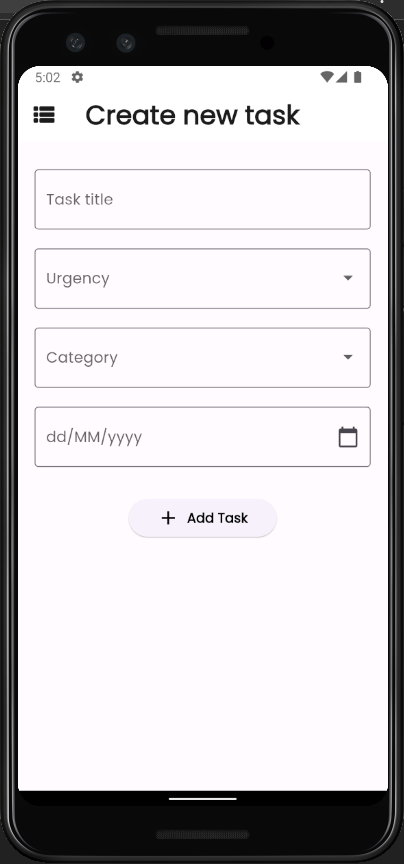

# Task Manager Flutter App

This is a simple task management application developed in Flutter, where you can add, edit, and delete tasks. Tasks can be categorized into three states: To do, In review, and Completed. The application utilizes the Provider package to manage the global state of the application.

## Features

- Add tasks
- Edit tasks
- Delete tasks
- Filter tasks by status (To do, In review, Completed)

## Screenshots

| Main screen with task list and filter buttons | Main screen with tasks |
|-----------------------------------------------|------------------------|
|  |  |

| Add task screen | Edit task screen |
|----------------------|----------------------|
|  |  |


## Prerequisites

Make sure you have Flutter installed and configured correctly in your development environment.

## Installation

1. Clone the repository:

git clone https://github.com/seu-usuario/nome-do-repositorio.git

2. Navigate to the project directory:

cd repository-name

3. Run the application:

flutter run

## Used Packages

- intl: ^0.19.0
- provider: ^6.1.2

## Project Structure

```shell
  .
  ├── lib/
      └── components/
          └── task_card_category.dart
          └── task_card_urgency.dart
          └── task_card.dart
      └── models/
          └── task_model.dart   
      └── pages/
          └── home_page.dart
          └── task_form_page.dart
          └── task_page.dart
      └── repositories/
          └── task_repository.dart
```

## How to Use

1. Upon opening the application, you will see the task list along with a FAB (Floating Action Button) to add a new task.
2. Click the FAB button to add a new task. Fill in the task details and click 'Save'.
3. To edit a task, simply click on the task in the list, and you will be redirected to the edit screen.
4. To delete a task, swipe the task left or right in the list and confirm deletion.
5. Use the filter buttons at the top of the screen to filter tasks by status.

--- 

© 2024 Guilherme Sanches


